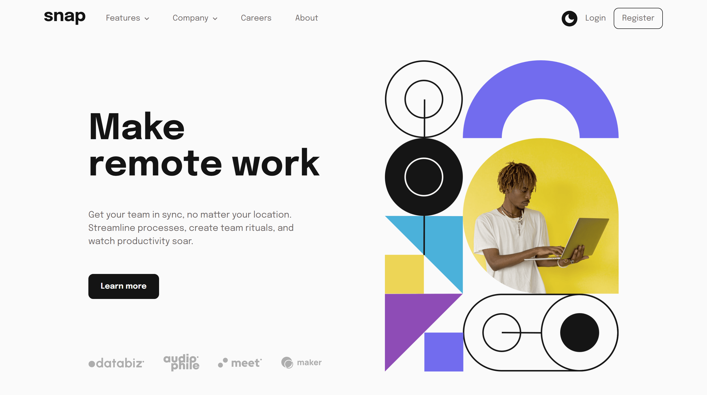

# Frontend Mentor - Intro section with dropdown navigation solution

This is a solution to the [Intro section with dropdown navigation challenge on Frontend Mentor](https://www.frontendmentor.io/challenges/intro-section-with-dropdown-navigation-ryaPetHE5). Frontend Mentor challenges help you improve your coding skills by building realistic projects.

## Table of contents

- [Overview](#overview)
  - [The challenge](#the-challenge)
  - [Additional Features](#additional-features)
  - [Screenshot](#screenshot)
  - [Links](#links)
- [My process](#my-process)
  - [Technology Used](#technology-used)
  - [What I Learned](#what-i-learned)
  - [Continued development](#continued-development)
  - [Useful resources](#useful-resources)
- [Author](#author)
- [Acknowledgements](#acknowledgments)

## Overview

### The challenge

Users should be able to:

- View the relevant dropdown menus on desktop and mobile when interacting with the navigation links
- View the optimal layout for the content depending on their device's screen size
- See hover states for all interactive elements on the page

### Additional Features

Here are some additional features that have been implemented in this project:

- Light and Dark Theme: The project now includes the option for users to switch between a light and dark theme, providing a customized and visually pleasing experience.

### Screenshot

### Links

<!--
  ┌───────────────────────────────────────────────────────────────────┐
  │                   Update with the correct links                   │
  └───────────────────────────────────────────────────────────────────┘
 -->

- **Solution:** [Add solution URL here](https://your-solution-url.com)
- **Live Site:** [Add live site URL here](https://your-live-site-url.com)

## My process

### Technology Used

This project was built using the following frontend technologies and methodologies:

- **Semantic HTML5 markup:** To provide a clear and meaningful structure to the content.
- **CSS custom properties:** To efficiently manage and reuse style values throughout the project.
- **CSS Grid:** To create powerful and flexible layouts with precise control over placement and alignment.
- **Flexbox:** To create flexible and responsive layouts.
- **JavaScript:** To add interactivity and dynamic functionality to the project.
- **SASS:** To write CSS more efficiently with nested rules, variables, and mixins.
- **BEM (Block Element Modifier):** To create modular, reusable, and maintainable CSS code.

### What I Learned

Throughout the development of this project, I had the opportunity to acquire new skills and knowledge. Here's what I gained:

- Leveraged the power of SASS map and list to ensure consistent and responsive media queries across different devices. 🎨💪
- Explored the usage of localstorage to store and retrieve theme values, enabling a seamless user experience across sessions. 🔒🌗
- Mastered the art of styling SVGs, specifically utilizing it for the captivating menu icon. 🎨

These learnings have not only enhanced my proficiency as a frontend developer but also opened up exciting possibilities for future projects. 🚀💡

### Continued development

The techniques I learned during this project will be invaluable in my future development work. Excited to apply these skills going forward! 🚀

### Useful resources

Here are some valuable resources that I found helpful during the development of this project:

- [The Net Ninja - Playlist: Light & Dark Mode with CSS Variables](https://youtube.com/playlist?list=PL4cUxeGkcC9jXaLsxbEmsPSOlb40ZLaKN) - This video playlist provided me with a comprehensive understanding of setting up themes using CSS variables.

- [MDN: prefers-color-scheme](https://developer.mozilla.org/en-US/docs/Web/CSS/@media/prefers-color-scheme) - The MDN documentation on prefers-color-scheme­ was instrumental in implementing the color scheme to allow the user's browser to load their preferred theme.

- [MDN: transform-origin](https://­developer.mozilla.org­/en-US/docs/Web/CSS/­transform-origin) - The MDN documentation on transform-origin helped me precisely set the origin of the menu SVG icon, resulting in the desired visual effect.

These resources played a vital role in enhancing my understanding and enabling the successful implementation of key features in this project.

## Author

This project was created by **Fortune Iyoha**. If you want to connect with me or view more of my projects, you can visit my [Frontend Mentor profile](https://www.frontendmentor.io/profile/fortune-i-o) or follow me on [Twitter](https://twitter.com/fortuneiyoha) for updates and web development discussions.

## Acknowledgments

The inspiration for the Light/Dark theme in this project came from [Melvin Aguilar's - Intro section with dropdown navigation (React + Tailwind + Dark mode) solution](https://www.frontendmentor.io/solutions/intro-section-with-dropdown-navigation-tmQXOQU78e). This creative approach to implementing a dropdown navigation with React, Tailwind, and Dark mode served as a valuable reference and source of inspiration.
